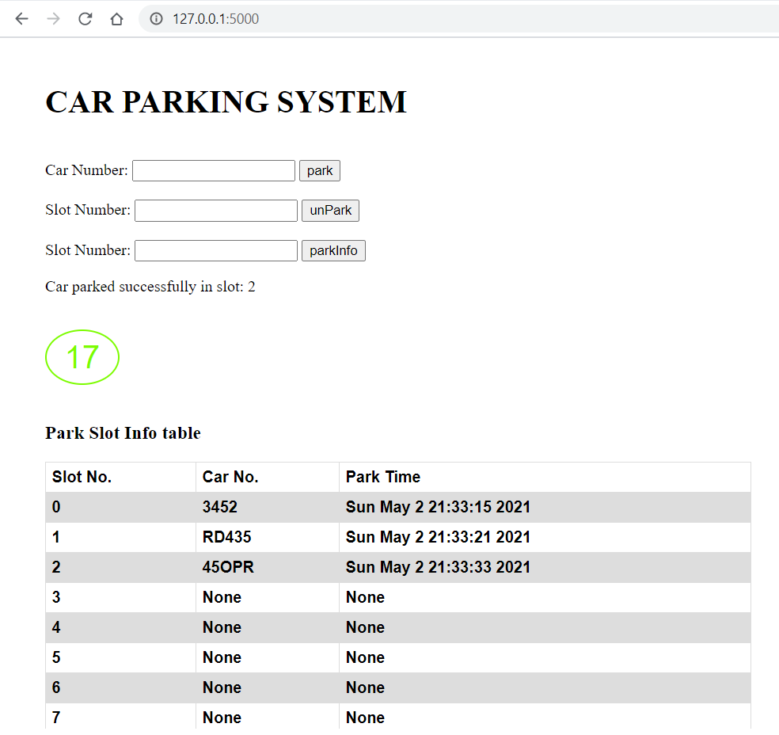

Hi, this is a simple backend server assignment/challenge for fun

## Introduction

This is a simple car parking system. It is limited by available parking slots. the connection is secured by limiting the requests within a time for each user.

The app manager can edit **parking slot size** as well as **IP request count** per **time** from **.env** file found in the root directory.

- `PARKING_LOT_SIZE=20`
- `IP_REQUEST_COUNT=10`
- `IP_REQUEST_TIME_LIMIT=10` seconds

The default setting is 20 available park slots.
10 requests in 10 seconds.

## What Users Can Do

> **Park a Car:** the user can park a car by inserting the car id or number, it accepts a string with numbers and letters. the system will choose the first available slot to park the car at.

> **Unpark a Car:** by inserting the slot number and clicking on the unPark button, it accepts only integers within the park slots range.

> **Get Park Info:** the user can enter the slot number and press on parkInfo button to receive the slot information. The field accepts the only integer within the slots range.

As shown on the image below, **message** will appear for showing **successful** operations as well as **errors**. The green **circle** shows the available slots and it turns red when the garage is full. The **table** shows all park information.



___

install the requierd packges

```sh
pip install python-dotenv
pip install Flask
```
For running the server

```sh
python src/app.py
```
